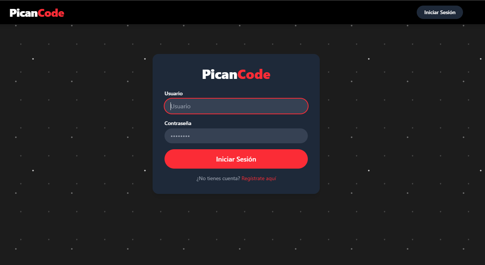
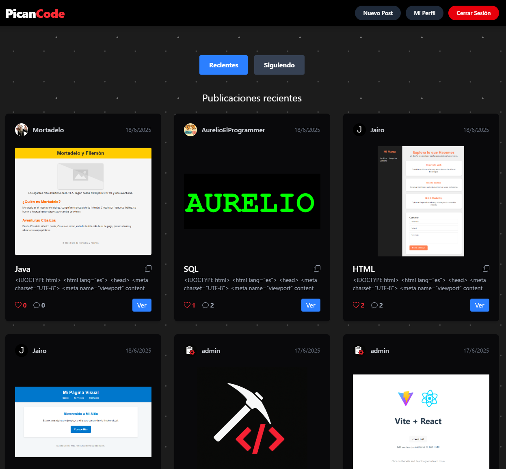
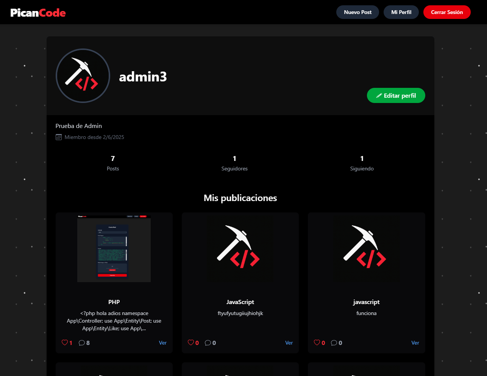
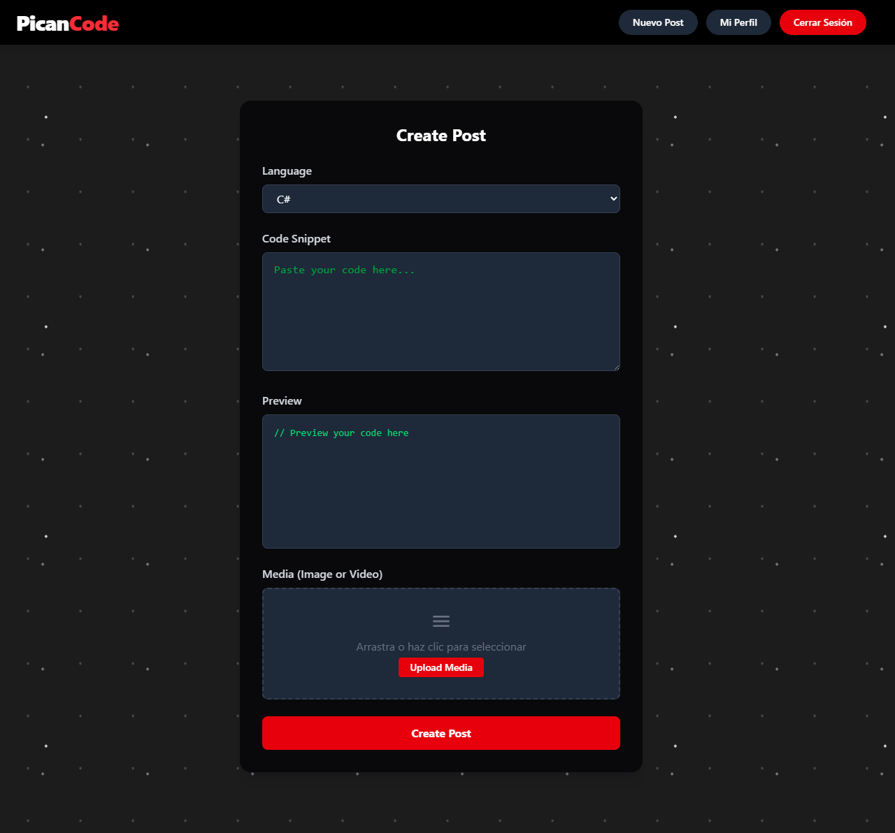
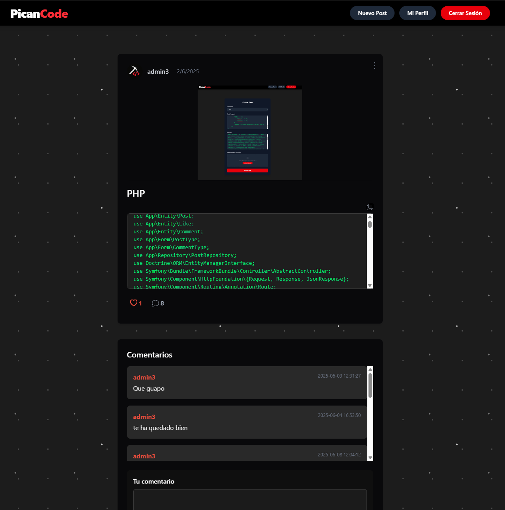

# PicanCode

## Description

PicanCode is a Symfony project that includes:

* Public login for regular users.
* Management area under `/gestion` with exclusive access for a single admin user (`picanadmin`).
* Full CRUD for Users, Posts, Comments, Likes, Followers, and Messages.
* Management panel with a sidebar for navigating between sections.

Here are some demo screenshots:

1. **User Login**  



2. **Home Page** 



3. **User Profile**  



4. **Post Creation Form**  



5. **Detailed Post View**  




## Requirements

* Windows 10/11 with WSL2 installed
* Linux distribution (Ubuntu recommended) in WSL
* Docker
* Dbeaver
* Devilbox (Docker-based environment), cloned under your WSL user
* PHP 8.1+
* Composer
* Node.js & npm for assets
* Symfony CLI (optional)

## Installation

1. **Set up Devilbox in WSL**
   Clone Devilbox into your home directory:

   ```bash
   cd ~
   git clone https://github.com/cytopia/devilbox.git
   cd devilbox
   cp env-example .env
   ```

2. **Start Devilbox**
   Launch the containers in the background:

   ```bash
   docker-compose up -d
   ```

3. **Enter the Devilbox shell**

   ```bash
   ./shell.sh
   ```

4. **Clone PicanCode inside Devilbox**

   ```bash
   cd /shared/httpd
   mkdir PicanCode
   cd PicanCode
   git clone https://github.com/JairoAlexandro/PicanCode.git html
   ```

5. **Install dependencies and build assets**

   ```bash
   cd html
   composer install
   ```

   ```bash
   npm install
   npm run dev

   ````

6. **Create the database schema and load fixtures**  
   ```bash
   php bin/console doctrine:database:create
   php bin/console doctrine:migrations:migrate
   # En caso de que las migraciones te den fallo, usa este comando
   php bin/console doctrine:schema:update --force
   php bin/console doctrine:fixtures:load
   ````

7. **Create symbolic link for Devilbox**

   ```bash
   cd /shared/httpd/PicanCode
   # Ver directorio html
   ls html/
   # Crear enlace simbólico entre html/public y htdocs
   ln -s html/public htdocs
   # Verificar
   ll
   ```

## Windows Hosts Configuration

On Windows, edit the `hosts` file to map your project:

1. Open Notepad (or another editor) as Administrator.

2. Open the file:

   ```
   C:\Windows\System32\drivers\etc\hosts
   ```

3. Add at the end:

   ```
   127.0.0.1 picancode.dvl.to
   ```

4. Save your changes.

## Usage

After creating the symbolic link:

1. Open your browser and go to [http://localhost](http://localhost).
2. Click on the **VirtualHost** tab.
3. Select your **PicanCode** project to view it in the browser.


## Accessing the Project Directory from Windows

To open your project files in an IDE (e.g., PHPStorm), navigate to:

```
//wsl.localhost/Ubuntu/home/<tuUsuario>/devilbox/data/www/
```

## Folder Structure

```
project-root/
├── assets/                     
│   ├── controllers/            
│   │   └── …                    
│   └── react/                 
│       └── controllers/
│           ├── PostIndex.jsx
│           ├── PostShow.jsx
│           ├── PostNew.jsx
│           ├── PostEdit.jsx
│           ├── Profile.jsx
│           └── ProfileEdit.jsx
├── src/                       
│   ├── Controller/             
│   │   ├── Front/              
│   │   │   └── PostController.php
│   │   ├── SecurityController.php
│   │   ├── ProfileController.php
│   │   └── UserController.php  
│   ├── Dto/                    
│   ├── Entity/                
│   ├── Form/                 
│   ├── Repository/            
│   ├── Security/              
│   ├── Service/               
│   └── Kernel.php            
├── templates/                 
│   ├── base.html.twig        
│   ├── security/               
│   │   └── login.html.twig
│   ├── gestion/              
│   │   ├── base.html.twig     
│   │   ├── panel.html.twig     
│   │   └── user/              
│   │       └── …               
│   ├── post/                 
│   │   └── …                   
│   ├── registration/          
│   │   └── …                   
│   └── user/                 
│       └── …                   
├── tests/                     
│   └── Controller/
│       ├── Front/
│       │   └── PostControllerTest.php
│       └── User/
│           ├── HomeControllerTest.php
│           ├── ProfileControllerTest.php
│           ├── RegistrationControllerTest.php
│           └── UserControllerTest.php
├── config/                    
├── migrations/                
├── public/                    
│   └── index.php
├── node_modules/              
├── vite.config.js             
├── vitest.config.js            
├── app.js                    
└── bootstrap.js              
```
## Inspecting Your Local MySQL Database

1. **Start DBeaver**  
   Open the application on your machine.

2. **Create a new connection**  
   - In the **Database Navigator** (left panel), right-click and select **New Database Connection**.  
   - Choose **MySQL** and click **Next**.

3. **Configure the connection**  
   - **Server Host**: `localhost` 
   - **Port**: `3306` 
   - **Database**: `picancode` 
   - **Username**: `db`  
   - **Password**: `db`  

4. **Connect**  
   Click **Finish** (or **Connect**) database will appear in the left tree.

5. **Browse your data**  
   - Your `picancode` database will appear in the left tree.  
   - **View data**:  
     - Double-click a table to open its data view.
     - Or right-click → **View Data** / **Edit Data** 
   - **Run queries:**:  
     - Right-click the database or table → **SQL Editor** → **New SQL Script**.  
     - Write your query and click **Execute** (▶️).

## Getting the Project Running
The `.env-example` contains everything needed to create your `.env`. Simply copy and paste it. In the `DATABASE_URL`, after `root:` use your database user and, after the colon, your password (default is `root:` with no password).

## Tests

1. Backend Tests
   First, create a test database named `picancode_test`:

   ```bash
   # crea la BD de test
   php bin/console doctrine:database:create --env=test

   # las migraciones
   php bin/console doctrine:migrations:migrate --env=test

   # En caso de que las migraciones te den fallo, usa este comando
   php bin/console doctrine:schema:update --force --env=test
   ```

   Then, inside the Devilbox shell in `/shared/httpd/PicanCode/html`, run:

   ```bash
   ./vendor/bin/phpunit --testdox
   ```
   To see overall coverage (should be over 60%):

   ```bash
   XDEBUG_MODE=coverage ./vendor/bin/phpunit --coverage-text
   ```

 You may need to adjust `.env.test` for the test database, but it should work by default.

 

2. Frontend Tests
   In the Devilbox shell, navigate to `/shared/httpd/PicanCode/html/assets` and run:

   ```bash
   npm run test
   ```
 Aquí dejo el resultado de los tests del front:
 

## License

This project is licensed under the MIT License.
