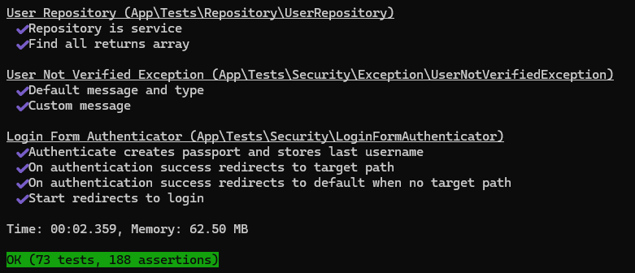
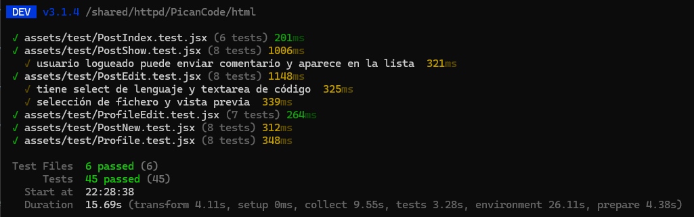

# PicanCode

## Descripción

PicanCode es un proyecto en Symfony que incluye:

* Login público para usuarios normales.
* Área de gestión bajo `/gestion` con acceso exclusivo para un único admin (`picanadmin`).
* CRUD completo para Usuarios, Posts, Comentarios, Likes, Seguidores y Mensajes.
* Panel de gestión con sidebar para navegar entre secciones.

## Requisitos

* Windows 10/11 con WSL2 instalado.
* Distribución Linux (Ubuntu recomendado) en WSL.
* Docker
* Dbeaver
* Devilbox (Docker-based env) clonado en tu usuario de WSL.
* PHP 8.1+
* Composer
* Node.js & npm para assets
* Symfony CLI (opcional)

## Instalación

1. **Configurar Devilbox en WSL**
   Clona Devilbox en tu directorio de usuario:

   ```bash
   cd ~
   git clone https://github.com/cytopia/devilbox.git
   cd devilbox
   cp env-example .env
   ```

2. **Arrancar Devilbox**
   Inicia los contenedores en segundo plano:

   ```bash
   docker-compose up -d
   ```

3. **Entrar al shell de Devilbox**

   ```bash
   ./shell.sh
   ```

4. **Clonar PicanCode dentro de Devilbox**

   ```bash
   cd /shared/httpd
   mkdir PicanCode
   cd PicanCode
   git clone https://github.com/JairoAlexandro/PicanCode.git html
   ```

5. **Instalar dependencias y assets**

   ```bash
   cd html
   composer install
   ```

   ```bash
   npm install
   npm run dev

   ````

6. **Crear esquema de base de datos y cargar fixtures**  
   ```bash
   php bin/console doctrine:database:create
   php bin/console doctrine:migrations:migrate
   # En caso de que las migraciones te den fallo, usa este comando
   php bin/console doctrine:schema:update --force
   php bin/console doctrine:fixtures:load
   ````

7. **Crear enlace simbólico para Devilbox**

   ```bash
   cd /shared/httpd/PicanCode
   # Ver directorio html
   ls html/
   # Crear enlace simbólico entre html/public y htdocs
   ln -s html/public htdocs
   # Verificar
   ll
   ```

## Configuración de hosts en Windows

En Windows, edita el archivo `hosts` para mapear tu proyecto:

1. Abre el Bloc de notas (u otro editor) con permisos de administrador.

2. Abre el fichero:

   ```
   C:\Windows\System32\drivers\etc\hosts
   ```

3. Añade al final:

   ```
   127.0.0.1 picancode.dvl.to
   ```

4. Guarda los cambios.

## Uso

Después de crear el enlace simbólico:

1. Abre tu navegador y ve a [http://localhost](http://localhost).
2. Haz click en la pestaña **VirtualHost**.
3. Selecciona tu proyecto **PicanCode** para verlo en el navegador.


## Acceso al directorio desde Windows

Para abrir los archivos de tu proyecto en un IDE (por ejemplo, PHPStorm), navega a:

```
//wsl.localhost/Ubuntu/home/<tuUsuario>/devilbox/data/www/
```

## Estructura de carpetas

```
project-root/
├── assets/                     ← Recursos de frontend (JS, CSS, imágenes)
│   ├── controllers/            ← Controladores de Stimulus/vanilla-JS
│   │   └── …                    
│   └── react/                  ← Aplicación React independiente
│       └── controllers/
│           ├── PostIndex.jsx
│           ├── PostShow.jsx
│           ├── PostNew.jsx
│           ├── PostEdit.jsx
│           ├── Profile.jsx
│           └── ProfileEdit.jsx
├── src/                        ← Código backend (Symfony PHP)
│   ├── Controller/             ← Controladores HTTP
│   │   ├── Front/              ← Endpoints públicos
│   │   │   └── PostController.php
│   │   ├── SecurityController.php
│   │   ├── ProfileController.php
│   │   └── UserController.php  ← CRUD usuarios (bajo `/gestion/user`)
│   ├── Dto/                    ← Data Transfer Objects
│   ├── Entity/                 ← Entidades Doctrine
│   ├── Form/                   ← Clases de formulario Symfony
│   ├── Repository/             ← Repositorios Doctrine
│   ├── Security/               ← Votantes, autenticadores, etc.
│   ├── Service/                ← Lógica de negocio reusable
│   └── Kernel.php              ← Punto de entrada de la aplicación
├── templates/                  ← Vistas Twig
│   ├── base.html.twig          ← Layout general (cabecera, pie)
│   ├── security/               ← Formularios de login/registro
│   │   └── login.html.twig
│   ├── gestion/                ← Área de administración
│   │   ├── base.html.twig      ← Layout con sidebar
│   │   ├── panel.html.twig     ← Dashboard de gestión
│   │   └── user/               ← Plantillas CRUD usuarios
│   │       └── …               
│   ├── post/                   ← Vistas públicas de posts
│   │   └── …                   
│   ├── registration/           ← Vistas de registro
│   │   └── …                   
│   └── user/                   ← Perfil y settings de usuario
│       └── …                   
├── tests/                      ← Pruebas unitarias e integradas
│   └── Controller/
│       ├── Front/
│       │   └── PostControllerTest.php
│       └── User/
│           ├── HomeControllerTest.php
│           ├── ProfileControllerTest.php
│           ├── RegistrationControllerTest.php
│           └── UserControllerTest.php
├── config/                     ← Configuración de Symfony (routes, services…)
├── migrations/                 ← Migraciones de BD
├── public/                     ← DocumentRoot (entry-point, assets compilados)
│   └── index.php
├── node_modules/               ← Dependencias NPM/Yarn
├── vite.config.js              ← Configuración de Vite
├── vitest.config.js            ← Configuración de Vitest (tests JS)
├── app.js                      ← Entry-point JS
└── bootstrap.js                ← Inicialización de JS
```
Sigue estos pasos para inspeccionar tu base de datos MySQL localmente:

1. **Inicia DBeaver**  
   Abre la aplicación en tu equipo.

2. **Crea una nueva conexión**  
   - En el panel **Database Navigator** (izquierda), haz clic derecho y selecciona **New Database Connection**.  
   - En el asistente, elige **MySQL** y pulsa **Next**.

3. **Configura la conexión**  
   - **Server Host**: `localhost` (valor por defecto).  
   - **Port**: `3306` (o el puerto que uses).  
   - **Database**: `picancode` (opcional, puedes dejarlo en blanco para listar todas).  
   - **Username**: `db`  
   - **Password**: `db`  

4. **Conéctate**  
   Haz clic en **Finish** (o **Connect**) para establecer la conexión.

5. **Navega por tus datos**  
   - En el árbol de la izquierda aparecerá tu base de datos `picancode`.  
   - **Ver contenido**:  
     - Doble clic sobre una tabla para abrir su vista de datos.  
     - O clic derecho → **View Data** / **Edit Data** para consultar o modificar registros.  
   - **Ejecutar consultas**:  
     - Haz clic derecho sobre la base o tabla y selecciona **SQL Editor** → **New SQL Script**.  
     - Escribe tu consulta y pulsa **Execute** (▶️).

## Funcionar el proyecto
En el .env-example esta todo lo necesario para que creeis el .env, simplemente copiad y pegadlo, en en database url, en la parte de "root:" root puede ser vuestro usuario y despues de los : ahí iría vuestra contraseña, pero por defecto se usa root: y sin contraseña.

## Test

1. Para ejecutar los test del back, lo primero es tener una copia de la base de datos llamada "picancode_test" la cual la puedes crear con los siguientes comandos:

   ```bash
   # crea la BD de test
   php bin/console doctrine:database:create --env=test

   # las migraciones
   php bin/console doctrine:migrations:migrate --env=test

   # En caso de que las migraciones te den fallo, usa este comando
   php bin/console doctrine:schema:update --force --env=test
   ```

 Despues tienes que entrar en el shell de devilbox, estar en la ruta /shared/httpd/PicanCode/html y ejecutar el siguiente comando:

   ```bash
   ./vendor/bin/phpunit --testdox
   ```
 Para ver el porcentaje total del proyecto seria con el siguiente comando, el cual este supera el 60% total testeado

   ```bash
   XDEBUG_MODE=coverage ./vendor/bin/phpunit --coverage-text
   ```


 Puede que tengas que retocar el .env.test para la base de datos de los test, pero como esta ya puesto deberia bastar.

 Aquí dejo el resultado de los tests del back:

 

2. Para ejecutar los test del front, tienes que entrar en el shell de devilbox y estar en la ruta /shared/httpd/PicanCode/html/assets y ejecutar el siguiente comando:

   ```bash
   npm run test
   ```
 Aquí dejo el resultado de los tests del front:
 

## Licencia

Licencia MIT. ¡A tope con el código! 🚀
